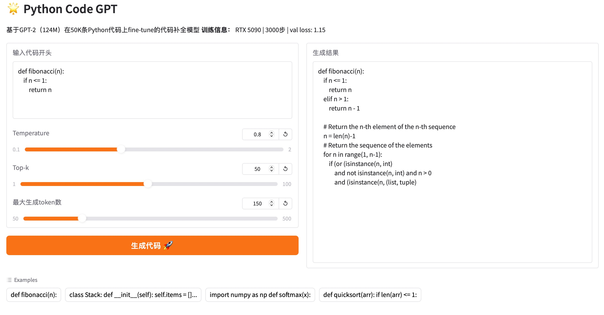
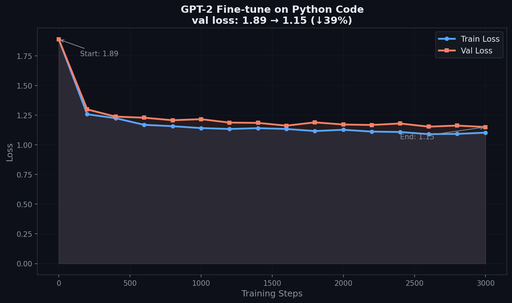

# 🐍 Python Code GPT

基于 GPT-2（124M）在 50K 条 Python 代码上 fine-tune 的代码补全模型。



---

## 项目亮点

### 1. 从零理解 Transformer 原理（`bigram.py`）

手工实现了完整的 GPT 架构，包括：

- **Multi-Head Self-Attention**：多头注意力，Q/K/V 矩阵并行计算，`n_embd % n_head == 0` 保证维度对齐
- **Causal Mask**：下三角掩码，防止 token 看到未来位置，对应语言模型"预测下一个词"的本质
- **Scaled Dot-Product Attention**：除以 `sqrt(head_size)` 防止 softmax 饱和，保持方差稳定
- **Residual Connection + Pre-Norm**：初始化时 Block 贡献≈0，梯度直接从 loss 流回输入，训练稳定
- **FeedForward Network**：两层 Linear + ReLU，对应论文公式 `FFN(x) = max(0, xW₁+b₁)W₂+b₂`

### 2. 理解 LLM 完整训练流程

```
互联网文本 → 清洗 → 预训练（学语言统计规律）
                         ↓
                   SFT（教对话格式）
                         ↓
                   RLHF（对齐人类偏好）
```

- **预训练**：GPT-2 在海量文本上已学会语言结构，本项目直接加载预训练权重
- **Fine-tune**：在 Python 代码上迁移学习，学习率从预训练的 `6e-4` 降至 `3e-5`（防止灾难性遗忘）
- **Tokenization**：使用 GPT-2 的 BPE 分词器，词表 50,257 个 token，存为 `uint16` 节省一半存储

### 3. 训练结果



| 指标 | 数值 |
|------|------|
| 初始 val loss | 1.89 |
| 最终 val loss | 1.15 |
| 下降幅度 | ↓ 39% |
| 训练步数 | 3,000 steps |
| 训练时间 | ~35 分钟 |
| 硬件 | RTX 5090 32GB |

---

## 技术细节

```
模型：    GPT-2 124M（OpenAI 预训练权重）
数据集：  CodeParrot Python 子集（50K 条，约 2 亿 token）
训练：    batch_size=32，block_size=1024，bfloat16，torch.compile
学习率：  3e-5（warmup 100 步，cosine decay）
框架：    PyTorch 2.7.0 + nanoGPT
```

**为什么 fine-tune 学习率要比预训练小 20 倍？**

预训练权重已在大量数据上收敛。大学习率会导致"灾难性遗忘"——破坏预训练学到的通用语言能力。小学习率让模型在保留原有能力的同时，缓慢适应代码数据分布。

**Temperature 和 Top-k 是什么？**

模型每步输出词表上所有 token 的概率分布，然后采样。Temperature 控制分布的尖锐程度：`temperature→0` 退化为贪心解码，`temperature→∞` 退化为均匀随机。Top-k 只从概率最高的 k 个 token 里选，避免采到奇怪的 token。

---

## 本地运行

```bash
# 安装依赖
pip install torch transformers tiktoken gradio

# 启动 Demo
python demo.py
```

---

## 文件说明

```
bigram.py          # 手写 Transformer（体现原理理解）
model.py           # nanoGPT GPT-2 实现
demo.py            # Gradio Demo 界面
sample_code.py     # 命令行代码生成
prepare.py         # 数据预处理（BPE tokenization）
finetune_python.py # 训练配置
```

---

## 参考

- [nanoGPT](https://github.com/karpathy/nanoGPT) - Andrej Karpathy
- [Attention is All You Need](https://arxiv.org/abs/1706.03762)
- [CodeParrot Dataset](https://huggingface.co/datasets/codeparrot/codeparrot-clean)
- [Deep Dive into LLMs like ChatGPT](https://www.youtube.com/watch?v=7xTGNNLPyMI) - Andrej Karpathy
